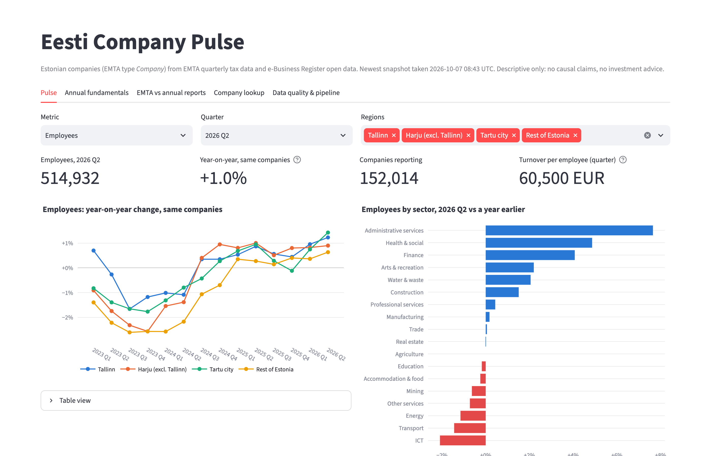
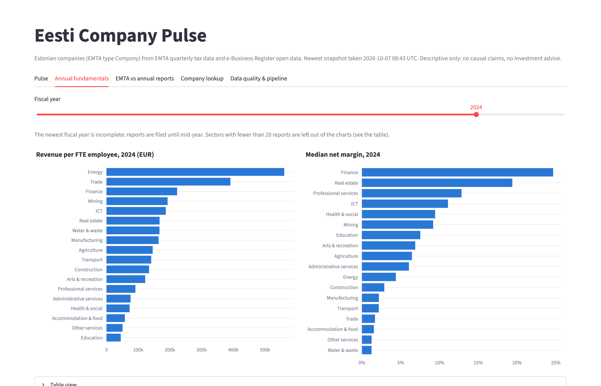
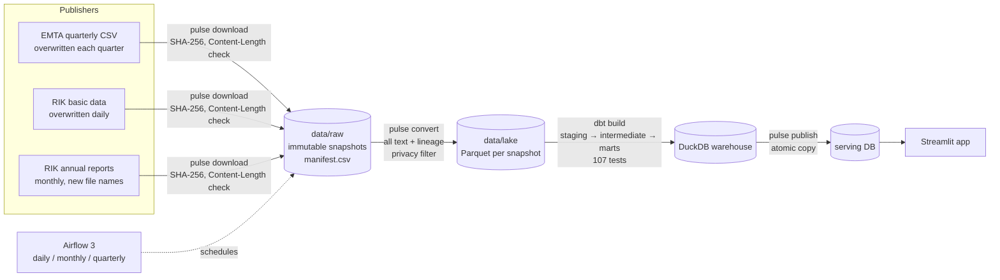

# Eesti Company Pulse

Which Estonian sectors and regions are growing, and which are shrinking?

An end-to-end data-engineering pipeline on Estonian government open data: quarterly tax, turnover and employment figures from the Tax and Customs Board (EMTA), joined with company register data and annual reports from the e-Business Register (RIK). The publishers overwrite their files in place, so the pipeline keeps its own history.

**Stack:** Python · DuckDB · Parquet · dbt · Airflow · Streamlit · Docker · GitHub Actions





## Architecture



| Layer | What happens | Where |
|---|---|---|
| Ingestion | Resolve current download URLs from the publishers' pages; store each new file version once per SHA-256; reject truncated downloads; retry with backoff | `src/pulse/sources.py`, `snapshots.py` |
| Lake | One Parquet file per snapshot, every column kept as text, lineage columns back to the raw file row; self-employed persons and non-residents removed and counted | `src/pulse/convert.py` |
| Staging | English names, strict type casts, one view per source, contract tests | `dbt/models/staging` |
| Intermediate | Wide → long unpivot, "latest appearance" rule across releases, EMTA revisions, SCD Type 2 company history, annual-report element resolution | `dbt/models/intermediate` |
| Marts | Company × quarter with point-in-time sector (ASOF joins), sector × region pulse, annual fundamentals, EMTA vs annual report, join coverage, data-quality ledger | `dbt/models/marts` |
| Serving | Marts copied atomically to a separate database, so the dashboard never blocks a build | `src/pulse/publish.py` |
| Orchestration | Airflow DAGs where each task is one idempotent CLI command; single-writer pool; retries; freshness checks | `orchestration/airflow/dags` |

## Engineering highlights

- **History from sources that overwrite themselves.** The register file changed between two checks on the same day. Every download is fingerprinted with SHA-256: new content is stored as an immutable, read-only snapshot, and unchanged content is only logged. A daily register file becomes a company history (SCD Type 2).
- **Idempotent, rerunnable steps.** Every `pulse` command can be rerun safely; Airflow only calls these commands, so any failed task can be rerun by hand.
- **Nothing dropped silently.** Rows removed for privacy are counted at conversion (`rows_total = rows_kept + rows_dropped`); `NULL` is never turned into 0; unmatched joins are reported in a coverage mart.
- **Identifiers stay text.** Automatic type detection would turn registry codes into integers and strip the leading zeros from location codes (`0596` → `596`). Types are cast explicitly in staging, where a bad value fails the build instead of becoming `NULL`.
- **Tested at every layer.** 107 dbt checks (data tests, grain tests, 6 unit tests) and 21 pytest tests. These include an end-to-end test that serves synthetic files over HTTP and runs the real downloader, converter and `dbt build`. CI runs lint, tests, Airflow DAG integrity and the Docker build on every push.

## What the data showed (and how the design changed)

- **EMTA's sector and county describe the publication date, not the tax year.** No company has two different sectors across 2022–2026 in one release, so attributes are stored per release and attached to quarters with ASOF joins, with a flag for what is truly point-in-time.
- **"Deleted companies are excluded" is not quite true.** EMTA's history file contains 15,624 companies the register lists as deleted. The join-coverage test therefore measures the companies active in the newest quarter (99.8% match).
- **Annual-report figures live under a different id** for reports that reference a filled report, and one table holds unlabelled pairs of values. Both are handled by explicit, tested rules; conflicting duplicate values become `NULL` with a conflict flag instead of a guess.
- **Two silent-NULL traps in DuckDB:** multi-column `UNPIVOT` drops a quarter if any value is NULL (72% of rows here), and `arg_max` skips NULL values. A row-count test and a dbt unit test caught them.

**Pulse, 2026 Q2:** employment +1.0% year on year for the same companies, after two years of decline. Administrative services, health and finance grew; ICT, transport and energy shrank.

## Metric definitions

| Metric | Definition |
|---|---|
| Employees | Persons with a valid employment-register entry on the last day of the quarter, excluding board members |
| Turnover | VAT return rows 1–3, including reverse-charge purchases, shifted one month (Q1 = December–February); can be negative |
| Labour taxes | Withheld income tax, social tax, funded pension and unemployment insurance paid in the quarter (cash basis) |
| Year-on-year growth | Same companies only: companies with a value in both the quarter and the same quarter a year earlier. Totals are summed first and divided last |
| Turnover per employee | Total turnover ÷ total employees, over companies with employees and known turnover |

All figures are descriptive. They show where change happened, not why.

## Limitations

- Register history starts with the first stored snapshot (September 2026); earlier register states cannot be recovered because the publisher does not keep them.
- EMTA revisions to past quarters can only be measured from the second stored EMTA release on.
- Sector and county are point-in-time only for quarters published after the first stored release; earlier quarters use the attributes of the release they came from, and are flagged.
- Companies with no EMTA record have no sector in the annual-fundamentals marts.
- Turnover includes reverse-charge purchases, so trading and holding companies look larger than their sales.

## Run it

Requires Python 3.11+.

```bash
python3 -m venv .venv
.venv/bin/pip install -e ".[dbt,app,dev]"
.venv/bin/pulse run                               # download, convert, dbt build, publish (~370 MB download)
.venv/bin/streamlit run app/streamlit_app.py      # dashboard on http://localhost:8501
.venv/bin/pytest                                  # tests on synthetic data, no download needed
```

With Docker:

```bash
docker compose --profile manual run --rm pipeline run   # the full pipeline in a container
docker compose up app                                   # dashboard on http://localhost:8501
docker compose up airflow                               # scheduler UI on http://localhost:8080
```

All state lives in `./data`, which is mounted into every container and never committed.

## Data sources

- **EMTA (Estonian Tax and Customs Board):** quarterly taxes paid, turnover and number of employees per taxpayer. [Statistics and open data](https://www.emta.ee/en/business-client/board-news-and-contact/news-press-information-statistics/statistics-and-open-data)
- **RIK e-Business Register:** company basic data and annual-report data. [Open data downloads](https://avaandmed.ariregister.rik.ee/en/downloading-open-data)

Data © the respective publishers, used under their open-data terms.

## Scope and privacy

Legal entities only. Self-employed persons (whose records carry natural persons' names) and non-residents are removed at the first processing step. The persons, shareholders and beneficial-owner datasets are never downloaded. No raw data, Parquet or database files are committed.
